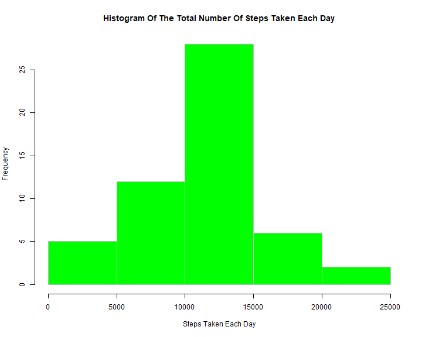
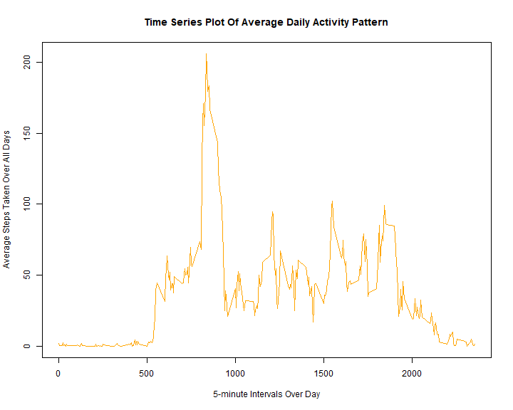
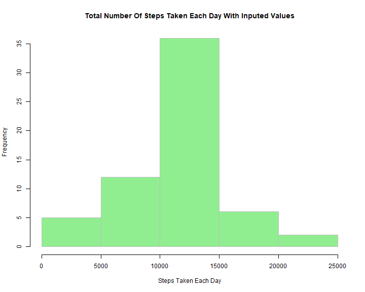
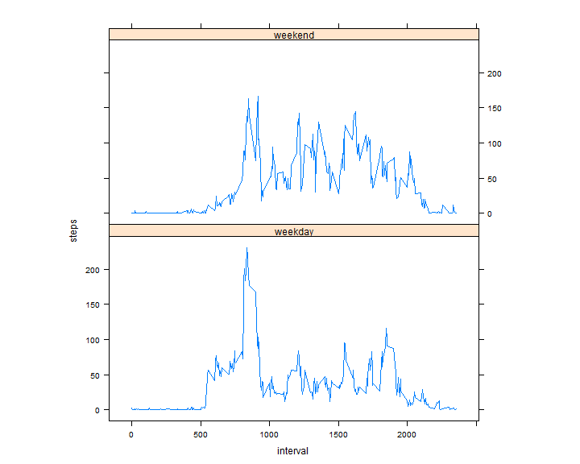

Peer Assessment 1
========================================================

### 1. Loading and procesing the data


#### Unzip & Reading the data set


```r
    unzip("activity.zip")
    activity <- read.csv("activity.csv")
    summary(activity)
```

```
##      steps                date          interval     
##  Min.   :  0.00   2012-10-01:  288   Min.   :   0.0  
##  1st Qu.:  0.00   2012-10-02:  288   1st Qu.: 588.8  
##  Median :  0.00   2012-10-03:  288   Median :1177.5  
##  Mean   : 37.38   2012-10-04:  288   Mean   :1177.5  
##  3rd Qu.: 12.00   2012-10-05:  288   3rd Qu.:1766.2  
##  Max.   :806.00   2012-10-06:  288   Max.   :2355.0  
##  NA's   :2304     (Other)   :15840
```


### 2. What is mean total number of steps taken per day?


#### Calculate the total number of steps taken per day


```r
    stepsTakenPerDay <- aggregate(steps ~ date, data = activity, FUN = sum, na.rm =TRUE)
```


#### Make a histogram of the total number of steps taken each day

```r
    xname <- "Steps Taken Each Day"
    yname <- "Frequency"
    hist(stepsTakenPerDay$steps,  
         main   = paste("Histogram Of The Total Number Of", xname), 
         xlab   = xname, 
         ylab   = yname, 
         col    = "green", 
         labels = FALSE,
         axes   = "TRUE",
         plot   = "TRUE",
         border = "gray")
```




#### Calculate and report the mean and median of the total number of steps taken per day


```r
    meanStepsTakenPerDay <- mean(stepsTakenPerDay$steps, trim = 0.5, na.rm = FALSE)
    medianStepsTakenPerDay <- median(stepsTakenPerDay$steps, na.rm = FALSE)
```

The mean total number of steps taken Per day: **10765**  
The median total number of steps taken Per day: **10765**


### 3. What is the average daily activity pattern?


#### find the average number of steps taken per 5 minute interval


```r
    averagePerInterval <- aggregate(steps ~ interval, data = activity, FUN = mean)
```

#### Make a time series plot of the 5-minute interval and the average number of steps taken, averaged across all days(y-axis)

```r
    plot(averagePerInterval, 
         type = "l", 
         main = "Time Series Plot Of Average Daily Activity Pattern", 
         xlab = "5-minute Intervals Over Day", 
         ylab = "Average Steps Taken Over All Days", 
         col  = "orange")
```



#### Which 5-minute interval, on average across all the days in the dataset, contains the maximum number of steps?


```r
    maxInterval <- averagePerInterval[which.max(averagePerInterval$steps), "interval"]
```


The 5-minute interval, on average across all the days in the dataset, that contains the maximum number of steps: **835**


### 4. Imputing missing values


#### calculate the total number of missing values in the dataset

```r
    totalMissing <- sum(is.na(activity))
```

The total number of missing values in the dataset: **2304**


#### Create a vector of steps with NAs replaced by inputed value (mean of 5-minute interval)


```r
    inputedSteps <- numeric()
    for (i in 1:nrow(activity)) {
        stepsVector <- activity[i, ]
        if (is.na(stepsVector$steps)) {
            steps <- subset(averagePerInterval, interval == stepsVector$interval)$steps
        } else {
            steps <- stepsVector$steps
        } 
        inputedSteps <- c(inputedSteps, steps)
    }
```


#### create a new dataset that is equal to the original dataset but with the missing data filled in.


```r
    inputedActivity <- activity
    inputedActivity$steps <- inputedSteps
```


#### find the total number of steps taken each day

```r
    inputedStepsPerDay <- aggregate(steps ~ date, data = inputedActivity, FUN = sum)
```


#### make a histogram of the total number of steps taken each day

```r
    hist(inputedStepsPerDay$steps, 
         main = paste("Total Number Of", xname, "With Inputed Values"), 
         xlab = xname, 
         col  = "lightgreen",
         border = "gray")
```




#### Calculate the mean and median total number of steps taken per day


```r
    inputedMeanStepsPerDay <- mean(inputedStepsPerDay$steps)
    inputedMedianStepsPerDay <- median(inputedStepsPerDay$steps)
```

The inputed mean total number of steps taken each day: **10766.19**  
The inputed median total number of steps taken each day: **10766.19**


### 4.Are there differences in activity patterns between weekdays and weekends?


```r
    inputedActivity$day = ifelse(as.POSIXlt(as.Date(inputedActivity$date))$wday%%6 == 0, "weekend","weekday")
```


#### Create a new factor variable in the dataset with two levels - "weekday" and "weekend" indicating whether a given date is a weekday or weekend day.


```r
    inputedActivity$day = factor(inputedActivity$day, levels = c("weekday", "weekend"))
```


```r
    averageSteps = aggregate(steps ~ interval + day, inputedActivity, mean)
```


#### Make a panel plot containing a time series plot (i.e. type="l") of the 5-minute interval (x-axis) and the average number of steps taken, averaged across all weekday days or weekend days (y-axis).


```r
library(lattice)
xyplot(steps ~ interval | factor(day), 
       data = averageSteps, 
       aspect = 1/2, 
       type = "l")
```



